# AGHRI Late-Fusion Visual Walkthrough

## Objective

This report follows one real AGHRI camera-LiDAR frame through the complete generic late-fusion pipeline. It mirrors the early-fusion weekly-report style, but the late-fusion object is a complete detector-generated 3D cuboid rather than an estimated centre from raw projected LiDAR points.

## Selected Real Frame

Recording: `footpath1_p1_oj+mk+gl_1walk+check_st_11_12_2024_1_label`  
Sample ID: `footpath1_p1_oj+mk+gl_1walk+check_st_11_12_2024_1_label/1731407186_709929023`  
Frame choice: original calibration-audit frame. Reason: The calibration audit already verified this real matched frame exactly; boundary clipping is retained and explained as part of the projection stage.

## Sensor Inputs

The ZED RGB image and Livox point cloud are the paired sensor inputs. The camera frame is `front_left_camera_optical_frame` and the LiDAR frame is `front_lidar_link`.

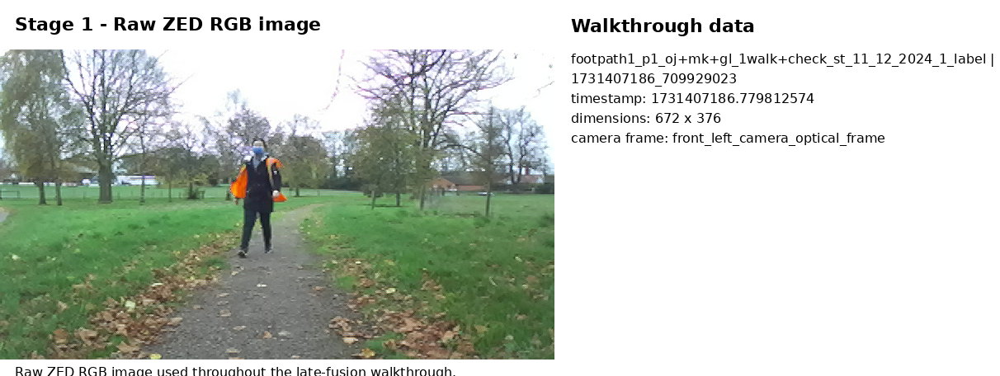

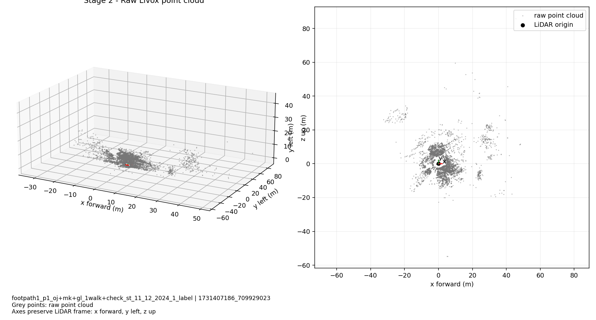

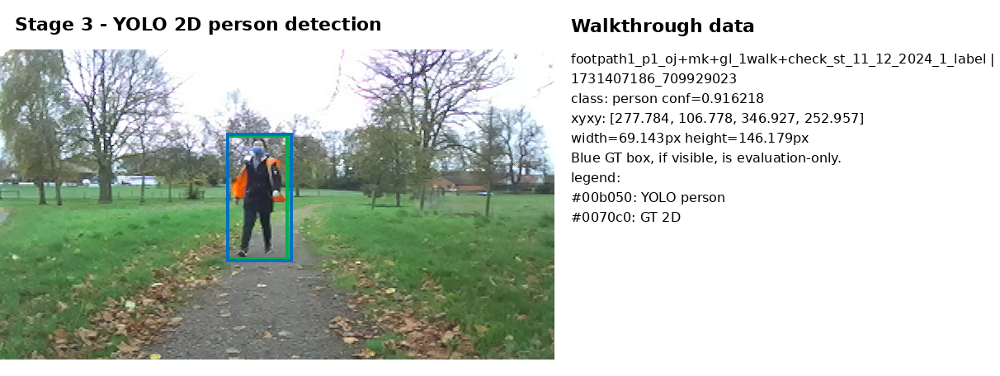


## YOLO Detection

The camera detector output is the real fine-tuned YOLO person detection:

```text
box xyxy = [277.7835693359375, 106.77847290039062, 346.9267883300781, 252.9573516845703]
confidence = 0.916218101978302
```


## PointPillars Detection

The LiDAR detector output is the real fine-tuned PointPillars 3D prediction:

```text
[x, y, z, length, width, height, yaw] = [5.315617561340332, 0.20094463229179382, 0.2806103229522705, 0.4411206543445587, 0.619935154914856, 1.5118756294250488, -0.0062798261642456055]
score = 0.7171115279197693
cache metadata box origin = bottom_center
geometry origin used = center
```

The projected cuboid was vertically high when the cached PointPillars z value was treated as bottom-centre. Interpreting the same real detector box as centre-origin aligns the projected cuboid with the visible person. This is a box-origin convention correction, not a calibration change.

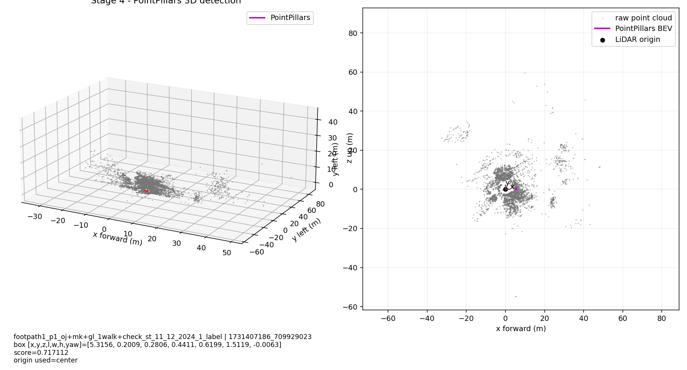

## Calibration

Both early and late fusion use the same physical calibration. The live ROS path uses CameraInfo/TF and the offline audit path uses the calibration ZIP JSON, which agree numerically for this representative bag.

```text
T_C<-L = [[2.220446049250313e-16, -1.0, 0.0, -0.22], [2.220446049250313e-16, 0.0, -1.0, 0.295], [1.0, 2.220446049250313e-16, 2.220446049250313e-16, 0.07499999999999993], [0.0, 0.0, 0.0, 1.0]]
P = [[477.29998779296875, 0.0, 339.74749755859375, 0.0], [0.0, 477.4949951171875, 191.94400024414062, 0.0], [0.0, 0.0, 1.0, 0.0]]
```

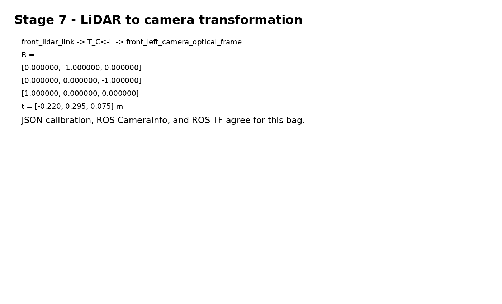

## 3D-Box Corner Construction

The eight corners follow the ordering in `late_fusion_pkg/projection.py`: lower face first, then upper face.

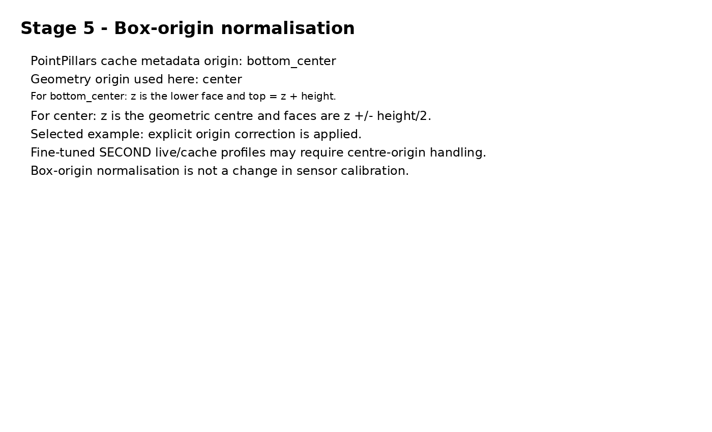

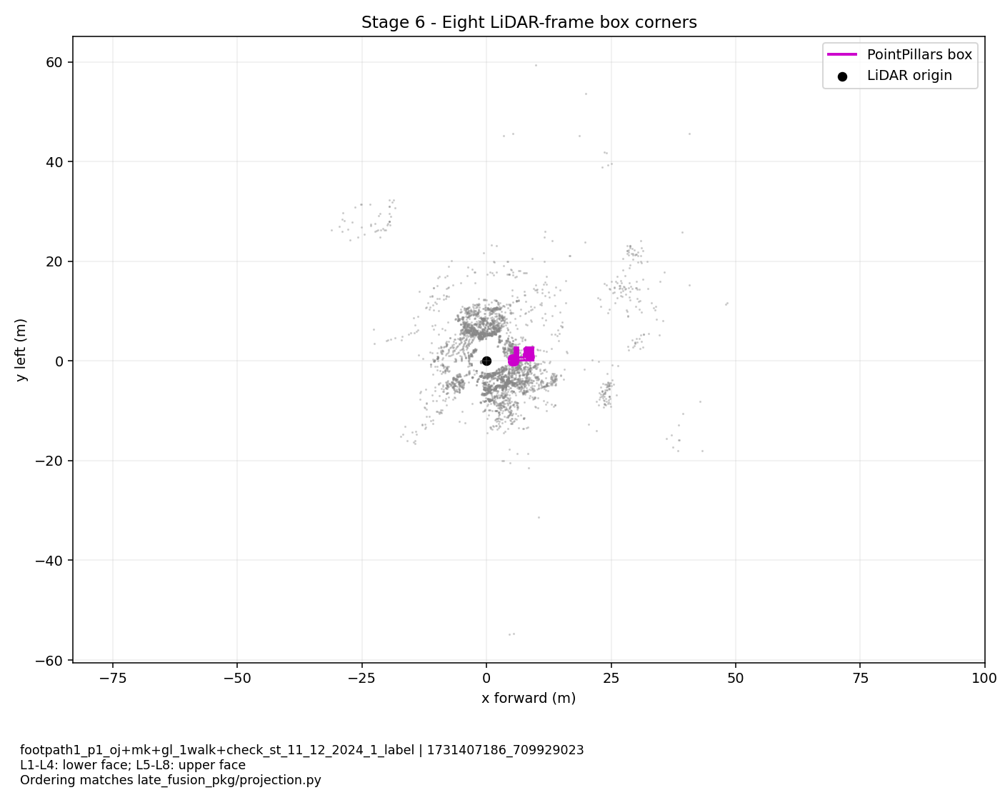

| corner | LiDAR-frame coordinate | camera-frame coordinate | projected pixel |
| --- | --- | --- | --- |
| L1/C1 | [5.093115, -0.107632, -0.475327] | [-0.112368, 0.770327, 5.168115] | [329.369757, 263.116472] |
| L2/C2 | [5.534227, -0.110402, -0.475327] | [-0.109598, 0.770327, 5.609227] | [330.421583, 257.519439] |
| L3/C3 | [5.538120, 0.509521, -0.475327] | [-0.729521, 0.770327, 5.613120] | [277.714195, 257.473958] |
| L4/C4 | [5.097008, 0.512291, -0.475327] | [-0.732291, 0.770327, 5.172008] | [272.167834, 263.062899] |
| L5/C5 | [5.093115, -0.107632, 1.036548] | [-0.112368, -0.741548, 5.168115] | [329.369757, 123.430525] |
| L6/C6 | [5.534227, -0.110402, 1.036548] | [-0.109598, -0.741548, 5.609227] | [330.421583, 128.818453] |
| L7/C7 | [5.538120, 0.509521, 1.036548] | [-0.729521, -0.741548, 5.613120] | [277.714195, 128.862235] |
| L8/C8 | [5.097008, 0.512291, 1.036548] | [-0.732291, -0.741548, 5.172008] | [272.167834, 123.482096] |

## LiDAR-to-Camera Transformation

Each LiDAR corner is multiplied by `T_C<-L` to obtain the camera-frame corner. Corners with `Z_camera <= 0` would be rejected before image projection; all selected-frame corners are projectable.

## Camera Projection

The camera projection uses the verified `CameraInfo.P` matrix. Projected corner pixels are shown below.

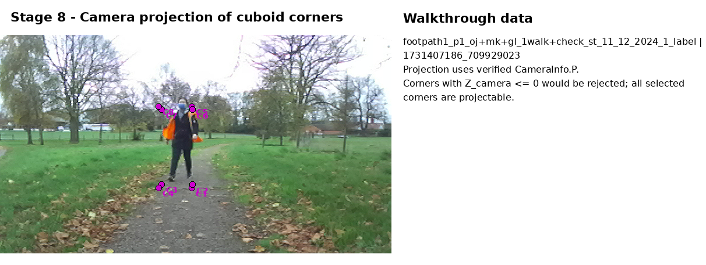

## Projected Rectangle

The projected cuboid is converted to an image-space envelope. This selected frame touches the upper-left image boundary, so the unclipped envelope is clipped to the actual image extent.

```text
unclipped = [272.1678344001285, 123.43052469077153, 330.4215834005085, 263.1164718533429]
clipped = [272.1678344001285, 123.43052469077153, 330.4215834005085, 263.1164718533429]
```

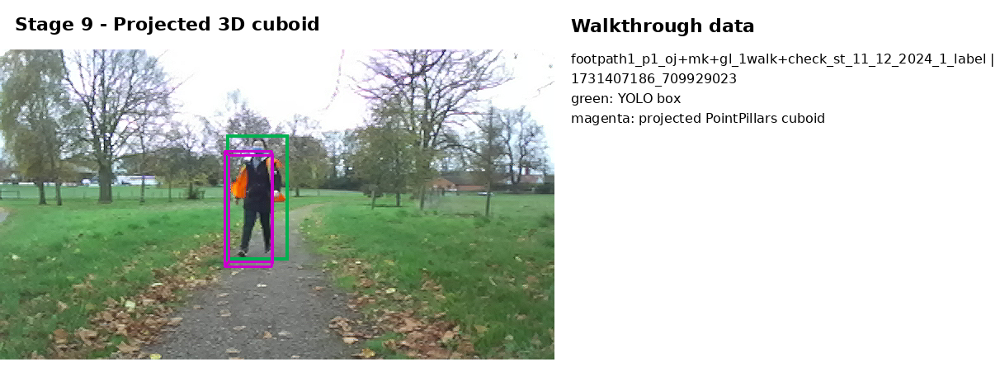

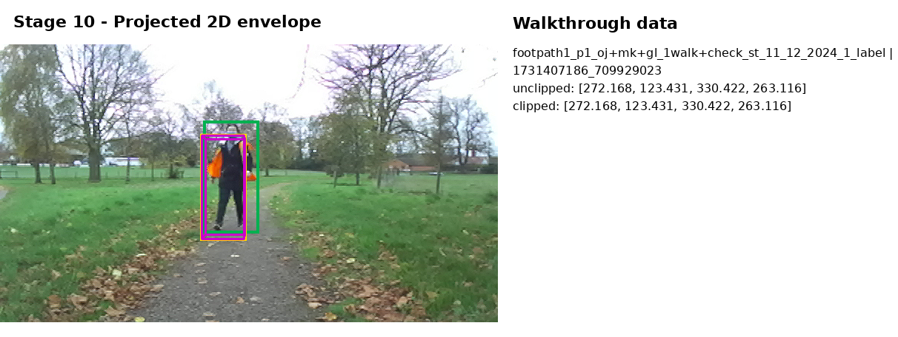

## IoU

The late-fusion association compares the YOLO rectangle with the projected LiDAR envelope using 2D image IoU.

```text
intersection = [277.7835693359375, 123.43052469077153, 330.4215834005085, 252.9573516845703]
YOLO area = 10107.278228092473
projected LiDAR area = 8137.23010488877
intersection area = 6818.034941038834
union area = 11426.47339194241
IoU = 0.5966875961787735
frozen cached association IoU = 0.5966875961787724
```

Cached association IoU already matches the explicit origin-corrected geometry.

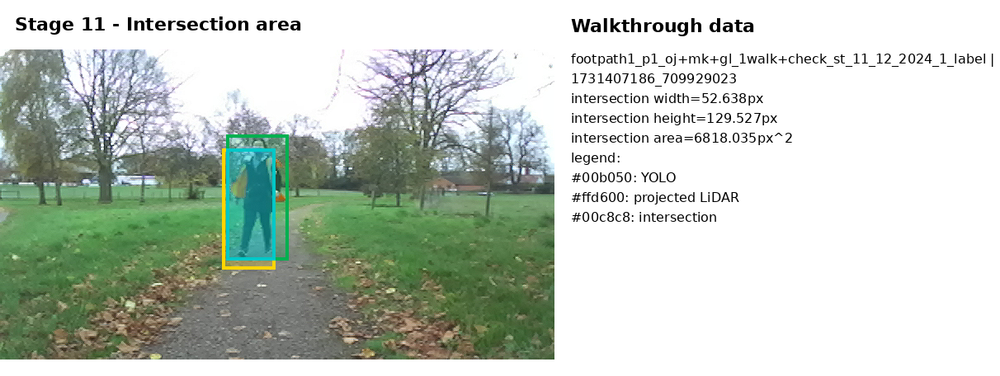

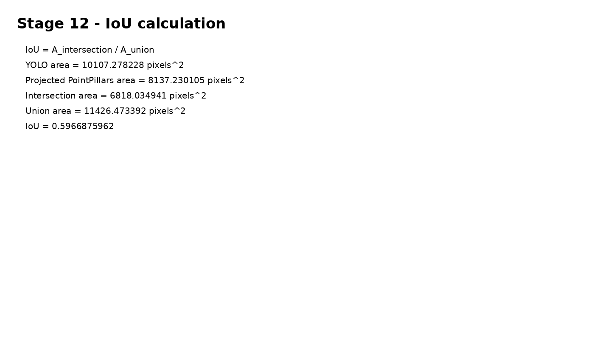

## Association

```text
IoU = 0.5966875962
threshold = 0.10
decision = MATCHED
```

Ground truth is not used to decide the camera-LiDAR match.

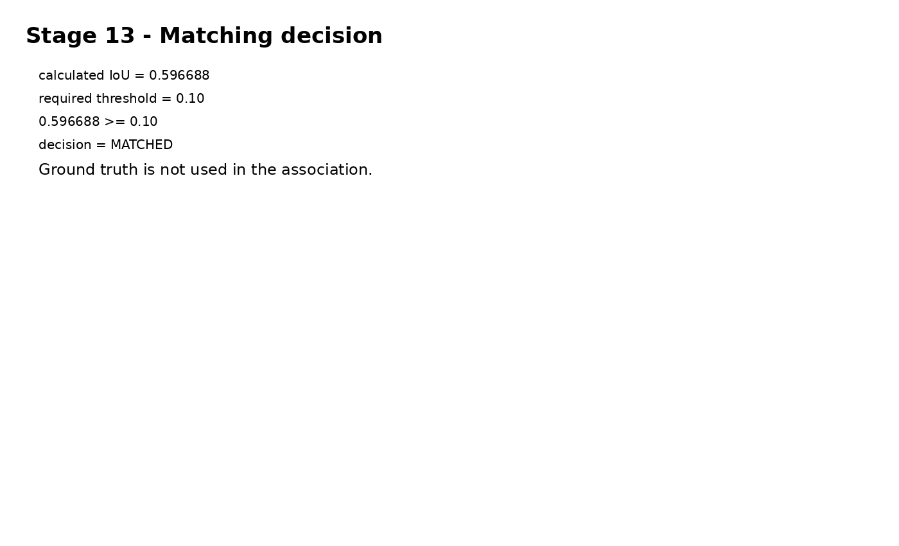

## Final Fused Outputs

For this selected pair, the YOLO detection is matched and the PointPillars box is matched. The fused output preserves the PointPillars 3D geometry and LiDAR confidence.

```text
matched 3D = 1
unmatched camera = 0
unmatched LiDAR = 0
ALL3D/final 3D = 1
```

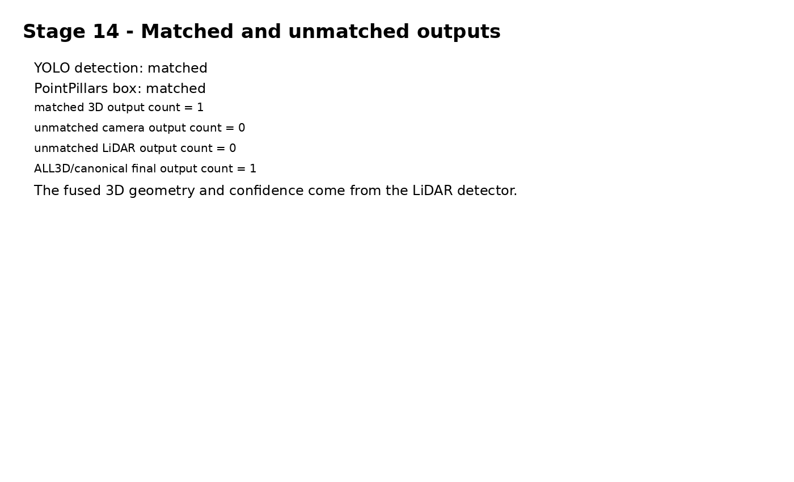

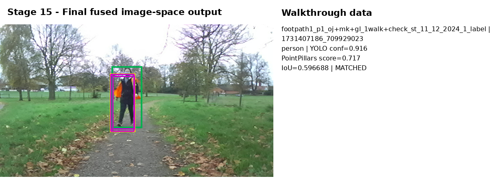

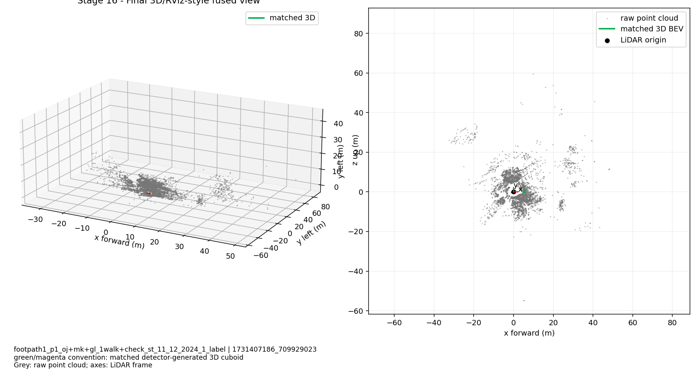

## Same-Frame DeepFusionMOT Continuation

The DeepFusionMOT layer starts after the matched/unmatched/ALL3D fusion outputs.
The figures below continue the same report frame into the tracking part of the
framework. For this real selected frame, there is one matched 3D detection and
zero unmatched camera or unmatched LiDAR detections, so the unmatched branches
are shown as empty/inactive rather than inventing extra people.

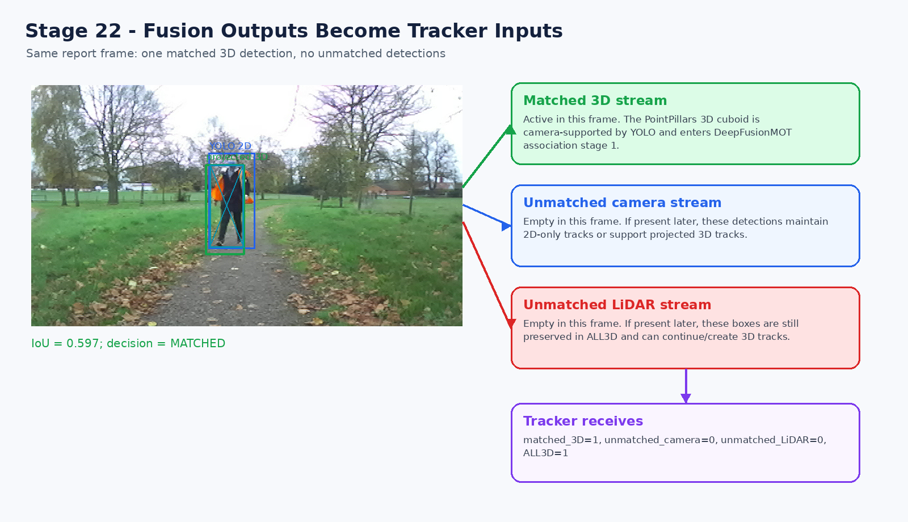

The matched 3D stream is active. The unmatched camera and unmatched LiDAR streams
are empty for this frame, but the visual still shows where those detections would
go in later frames.

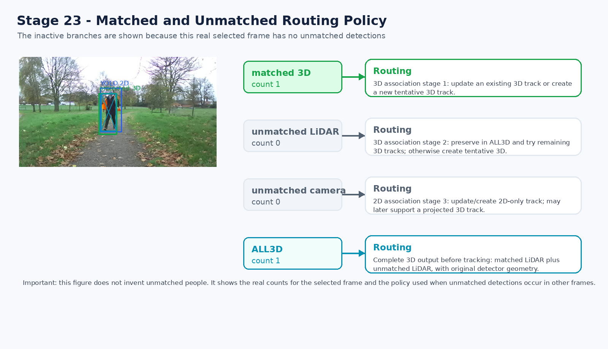

The matched 3D cuboid is consumed first by the DeepFusionMOT association cascade.
If a compatible 3D track already exists, the cuboid updates that track. If no
track matches, it starts a new tentative 3D track.

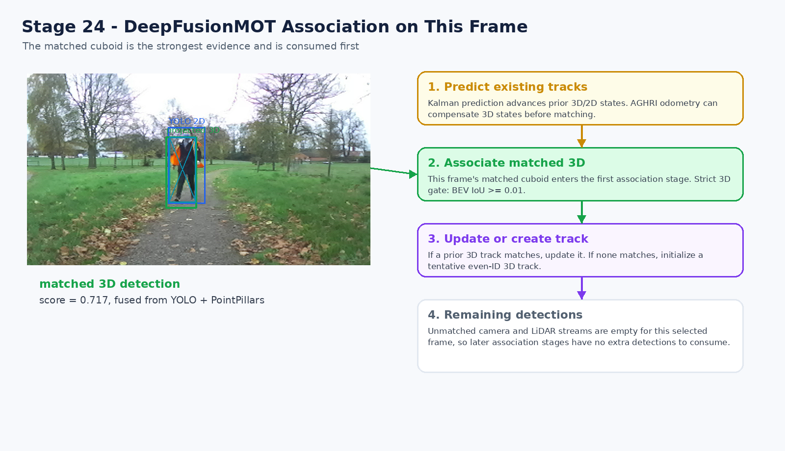

The tracker adds temporal identity and lifecycle state. It does not reshape the
PointPillars cuboid. In strict DeepFusionMOT mode, 3D track IDs are even, tracks
become confirmed after enough hits, and stale confirmed tracks can survive for a
limited number of missed frames.

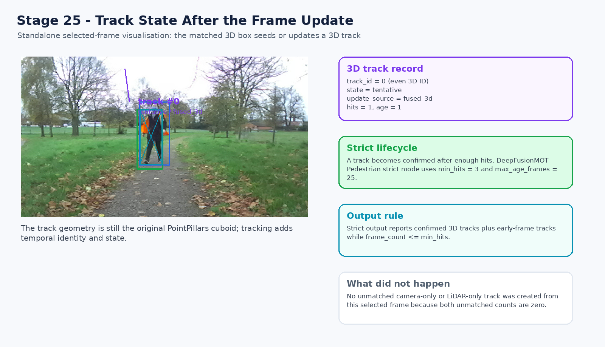

The next frame starts from the previous track state. Kalman prediction advances
the state, optional AGHRI odometry moves it into the current LiDAR frame, and the
new frame's matched/unmatched detections are associated back to the predicted
track state.

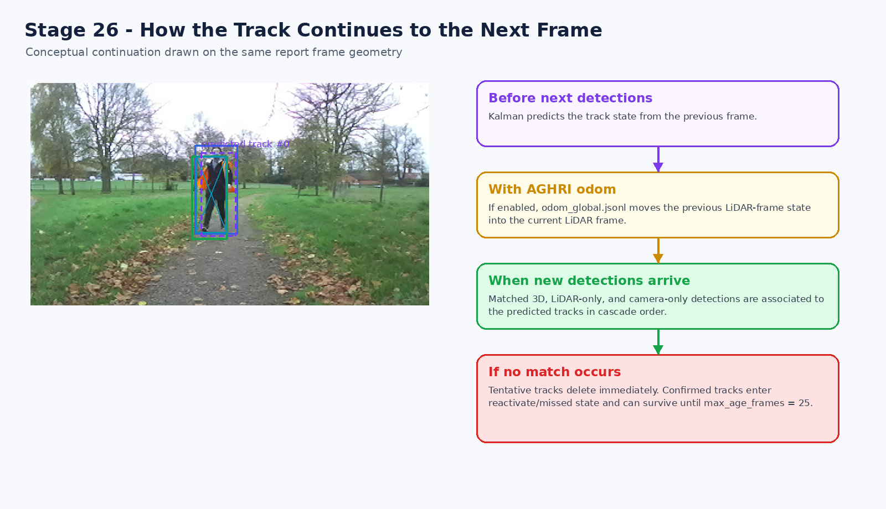

The complete same-frame flow is summarised below.

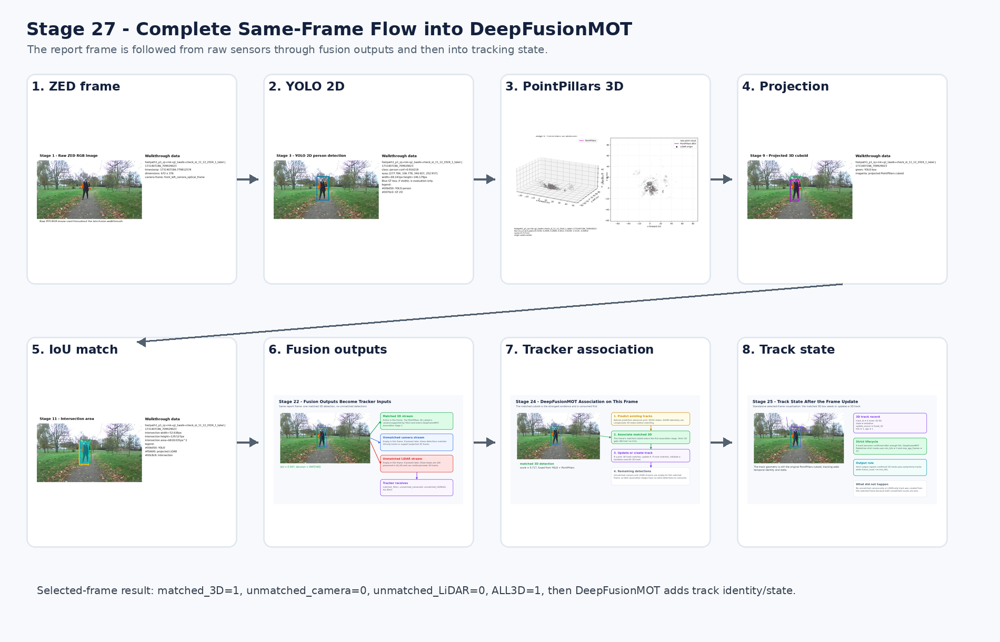

## Ground-Truth Evaluation

A valid 3D annotation was found for the selected frame. BEV IoU=0.575607, approximate 3D IoU=0.247801, centre error=0.065888 m.

Ground truth is used for evaluation after fusion. It is not used to decide the camera-LiDAR match. The fusion IoU above is a 2D image IoU, not BEV IoU or 3D IoU.

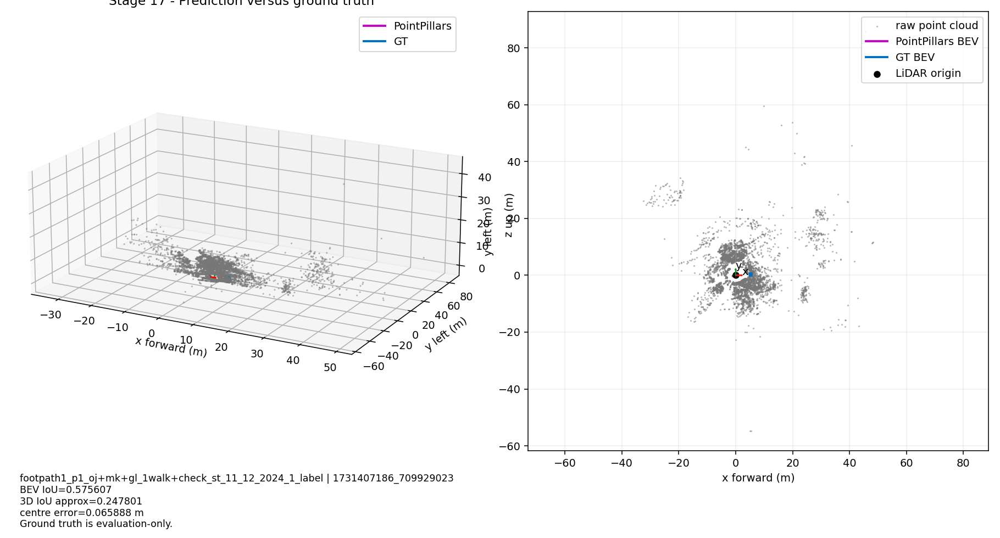

## Early Fusion and Late Fusion Using the Same Calibration

Both methods use the same physical calibration, but they fuse different objects. Early fusion projects raw LiDAR points into the YOLO box, filters candidate points, and estimates one 3D centre. Late fusion projects a complete LiDAR detector cuboid, compares its projected envelope with the YOLO box, and preserves or rejects the complete 3D detection.

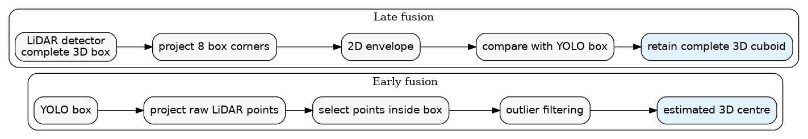

## Offline Evaluation Workflow

Offline evaluation uses dataset files, frozen detector caches, late fusion, and metric scripts. It is separated from live ROS deployment.

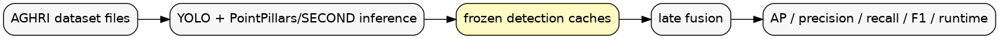

## Fully Online ROS Workflow

The online ROS 2 implementation consumes image and point-cloud topics, runs live detectors, performs projection/association online, and publishes fused topics for image visualisation and RViz. Cached ROS replay remains the reproducible path for metric-linked visual checks, while the online launch path is the deployment-style path.

For AGHRI live mode, the LiDAR worker runs under the isolated `aghri-mmdet3d` Conda Python and resolves fine-tuned SECOND/PointPillars base configs from the local benchmark checkout. A 2026-07-15 PointPillars probe confirmed live LiDAR detections, matched 3D markers, and the fused projection image after this base-config path fix.

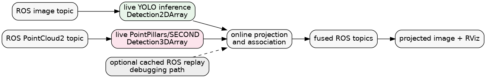

## Complete Numerical Calculation

The full numerical calculation is available in `late_fusion_worked_calculation.md` and `late_fusion_worked_calculation.json`.

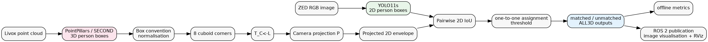

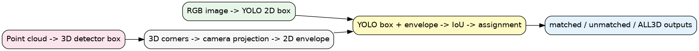

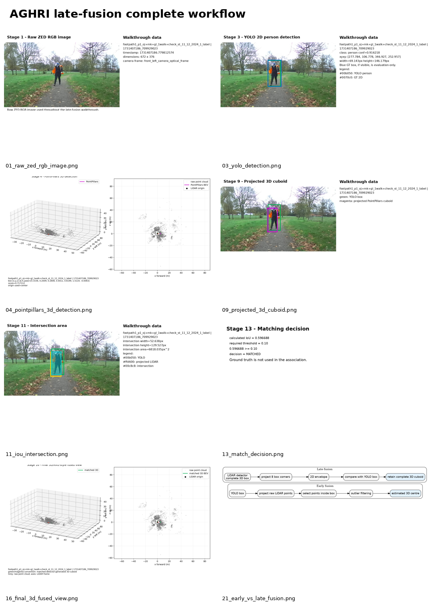

## Key Points To Remember

- Same physical calibration, different fusion representation.
- Early fusion estimates a 3D centre from raw projected LiDAR points.
- Late fusion preserves a learned 3D cuboid from PointPillars or SECOND.
- The association decision uses projected 2D envelope IoU with the YOLO box.
- DeepFusionMOT starts after matched/unmatched/ALL3D fusion outputs and adds temporal track identity/state.
- Ground truth is evaluation-only and is not used for association.
